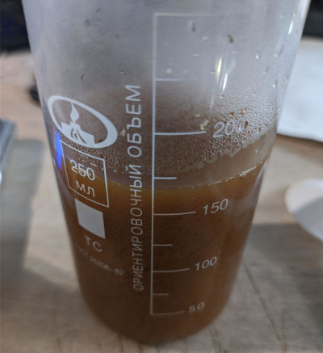
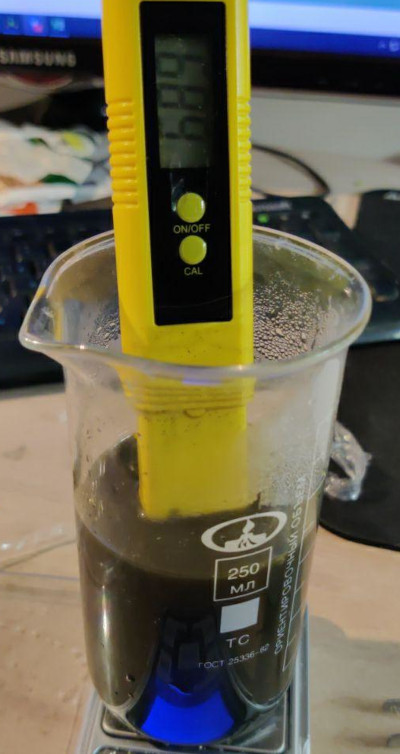
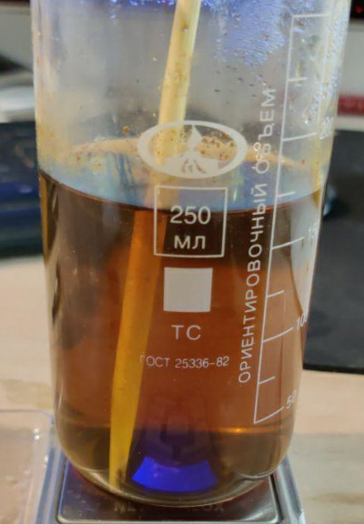

# Хелаты

Данный раздел находится в разработке!

# Виды хелаторов

* ЭДТА, DTPA (этилендиаминтетрауксусная кислота), комплексон-III, трилон-Б, хелатон III.
* ДТПА, DTPA (диэтилентриаминпентауксусная кислота), трилон-С, пентетиковая кислота
* EDDHA 

`DTPA` и `EDDHA` в домашних условиях не изготавливаются.

# Подготовка

Для приготовления микро нам нужны следующие компоненты

1) Хелаторы, один из них:
   - Трилон Б
      * C10H14N2Na2O8*2H2O (Na2 - `ди`натриевая соль), ЭДТУК, EDTA
        
        Лучше использовать её.
        
      * C10H12N2O8Na4*4H2O (Na4 - `тетра`натриевая соль), ЭДТУК, EDTA
2) KOH
3) Основное микро
   * Fe - Сульфат железа (II) семиводный `FeSO4*7H2O` (Fe 20,1%)
   * Mn - Марганец (II) сернокислый 5-водный, `MnSO4*5H2O` (Mn 21.95%)
   * B - Борная кислота `H3BO3`, (B 17,5%)
   * Zn - Цинк сернокислый 7-водный `ZnSO4*7H2O`, (Zn 22,7%)
   * Cu - Медь (II) сернокислая 5-водная `CuSO4*5H2O`, (Cu 25,5%)
   * Mo - Аммоний молибденовокислый 4х-водный `(NH4)6Mo7O24*4H2O`, (Mo 54,3%)
    
4) Опционально, обычно не требуется
   * Co - Сульфат кобальта семиводный `CoSO4*7H2O` (Co 21%)
   * Si - Кремнекислый натрий пятиводный `Na2SiO3*5H2O` (Si 13,2%)

5) Стакан термостойкий на 250-400мл. Не колба, т.к. нужно измерять pH
6) Мешалка или стеклянная палочка

# Изготовление EDTA, ЭДТА, ЭДТУК
   
## Расчет

Сначала определяемся с профилем микро.

Допустим у наc профиль, в микрограммах:

`Fe=4500; Mn=600; B=600; Zn=400; Cu=100; Mo=100`

Хотим приготовить концентрат микро 1:1000 на 2 литра

На 1 моль железа приходится 1 моль Трилона-Б

Находим молярную массу Трилона Б: - `372.2369`

* [Можно воспользоваться этим калькулятором](https://apkawa.github.io/react-fertilizer-calculator/#/formula/C10H14N2Na2O8*2H2O/)
* [Или этим](https://ru.webqc.org/molecular-weight-of-C10H14N2Na2O8%2A2H2O.html)


Находим молярную массу сульфата железа: - `278.0146`

Делим моли трилона на моли железа, получаем коэфициент:

```
372.2369 / 278.0146 = 1.3389
```

Далее нужно вычислить навеску железа

Есть 2 пути.

1) Рассчитать самому
   
   * Вычисляем массовую долю железа в сульфате железа, с учетом паспорта (ЧДА 100,6%):
   ``` 
   Fe% = (М(Fe) / M(FeSO4*7H2O) ) * (чистота / 100) 
   Fe% = (55.8452 / 278.0146) * (100.6 / 100) = 0.2021
   ```
   M(Fe) и M(FeSO4*7H2O) - молярные массы
   
   * Вычисляем необходимое количество сульфата железа в г/л
   ```
   m = ((Профиль / Fe% ) / мкг в г) * V * C
   m = ((4500 / 0.2021) / 10^6) * 2 * 1000 = 44.5г
   ```
   V - объем 
   C - концентрация
   

2) Воспользоваться калькулятором
   * Забиваем формулу сульфата железа с учетом паспорта в удобрения
   * Выбираем в калькуляторе сульфат железа, профиль, желаемый объем и концентрацию
   * Calculate
   
Получаем `44.5г` сульфата железа.
Аналогично поступаем с остальными элементами:
   * `5.47г` - Марганец (II) сернокислый 5-водный
   * `0.79г` - Медь сернокислая (II) 5-водная
   * `3.58г` - Цинк сернокислый
   * `6.87г` - Борная кислота
   * `0.37г` - Аммоний молибденовокислый 4-водный


Необходимое количество Трилона Б, с учетом паспорта (ЧДА 99,6%)
```
(44.5 * 1.3389) * ((100 + (100 - 99.6)) / 100) =  59.82г 
```

Необходимое количество KOH, с учетом паспорта (ЧДА 90%)

[2 KOH + FeSO4 → K2SO4 + Fe(OH)2](https://chemequations.com/ru/?s=KOH%20%2B%20FeSO4%20%3D%20K2SO4%20%2B%20Fe(OH)2&ref=search)

```
56.10564 * 2 / 278.0146 = 0.403
(44.5 * 0.403) * ((100 + (100 - 90)) / 100)  = 19.72г
```

Массу остальных солей не учитываем, т.к. нет необходимости хелатировать остальные соли. 
Хелатирование солей нужно в случае аквариумистики, чтобы рыбам было хорошо.


## Изготовление

### Способ Сергея

1. Налить в стакан `100мл` кипятка
2. Добавить рассчитанную выше навеску сульфата железа - `44.5г`
3. Тщательно перемешивать. Цвет бурый 
   
   
   
4. В зависимости от вида трилона, ди или тетра
   * Динатриевая соль 
     
      Добавлять KOH до тех пор пока не станет pH=7
     
      Цвет становится черным, как кока-кола 
     
      
      
   * Тетранатриевая соль 
     
      Ничего не делать, раствор дб кислым. (TODO уточнить)
     
5. Высыпать трилон, перемешивая. Не всю навеску сразу, а понемногу. 
   
   Раствор начнет светлеть но еще будет мутным. 
   
   Как только он станет прозрачным - все прореагировало. 
   
   Раствор может еще покраснеть через некоторое время
   
   

6. Добавить оставшееся микро
7. Разбавить, в нашем случае до 2л

### Способ Вильяма

1. Налить в стакан `100мл` кипятка
2. Добавить рассчитанную выше навеску сульфата железа - `44.5г`
3. Тщательно перемешивать. Цвет бурый 
   
   
   
4. Высыпать трилон, перемешивая. Всю рассчитанную навеску.
   (TODO картиночки)
   
5. В зависимости от вида трилона, ди или тетра
   
   * Динатриевая соль 
     
     Добавлять понемногу KOH 
     
     И когда допустим только посветлел, я немного мути оставляю, оно само доходит 
     
     после молочного цвета
     

   * Тетранатриевая соль 
     
     Ничего не делать, раствор дб кислым. (TODO уточнить)


6. Добавить оставшееся микро
7. Разбавить, в нашем случае до 2л

## Способ `Alex Simonec` (технолога по удобрениям)

1. Готовим 0,1 молярный раствор  ЕДТА железа, с концентрацией Fe = 5,55 гр/л .
2. Делаем навески: 
   
   * 1 л обычной воды. 
   * 90 грамм дистиллированной воды, 
   * расчетное количество Сульфата Железа
   * расчетное количество Трилона Б 
   * расчетное количество KOH
     
2. Берется 2 л бутылка и наливается в нее 1 л обычной воды.  
   
   Добавить сульфат железа, закрыть крышкой и расколачивать до полного растворения.
   
   Открыть крышку и засыпать KOH.
   
   Закрыть крышку и перемешиваешь до полного растворения. 
   
3. начнется реакция: вода становиться прозрачной, выпадает темный осадок.
4. Поставить на 12-24 часов отстояться.
5. После отстоя максимально слить воду, оставляя только осадок.
6. После к осадку долить 90 грамм дистиллированной воды и добавить Трилон Б, размешать, раствор зеленеет. 
7. рН должен быть в диапазоне 4-6, если не доходить - догони до 5 щелочью, порциями по 0,05 грамм.
   
8. Добавить оставшееся микро
9. Разбавить, в нашем случае до 2л

# Ссылки

* https://www.aqa.ru/forum/dtpa-317975-page2
* http://www.chemport.ru/forum/viewtopic.php?f=4&t=22842&hilit=%D1%82%D1%80%D0%B8%D0%BB%D0%BE%D0%BD+%D0%91&start=20
