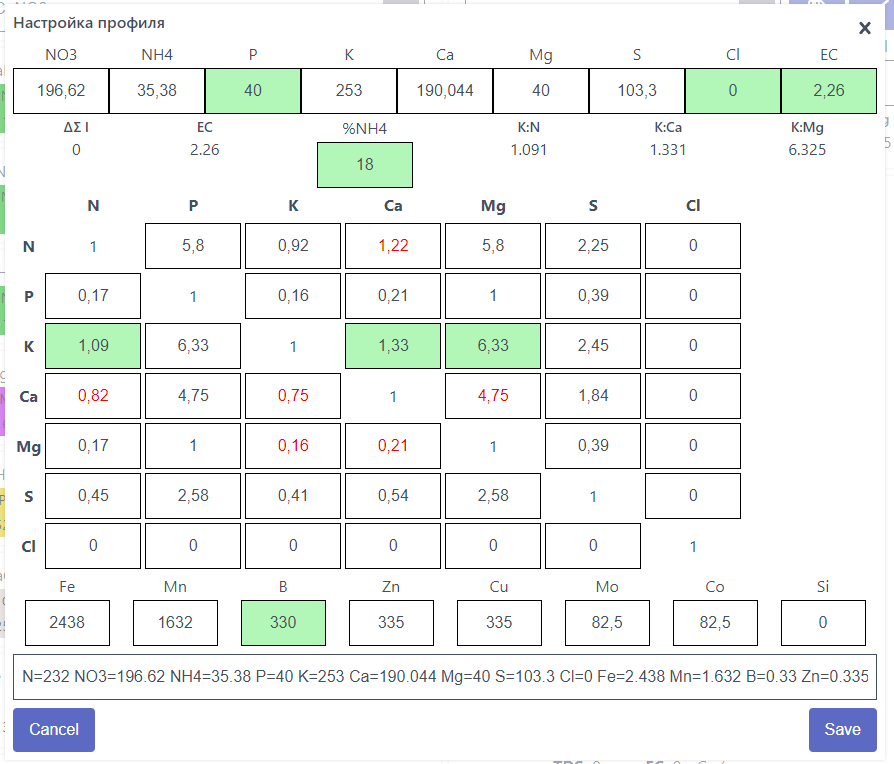

## Интерфейс настройки профиля

Идея в том что профиль определяет не состав в ppm (верхняя часть скриншота), а его ключевые соотношения.
Меняя соотношения - адаптируем рецепт под конкретные условия

Зеленым отмечены соотношения которые определяют рецепт и соотношения не меняются при изменении других соотношений.

Красным отмечены антагонисты, менять не нужно но контролируем диапазоны которые могут измениться в процессе изменения рецепта

При изменении какого то соотношения весь рецепт может измениться и какие то диапазоны выйти из границ

## Ключевые соотношения, определяющие рецепт

### %NH4 (NH4:NO3)

Основное соотношение управляющее стабильностью pH раствора (физиологический кислотно/щелочной баланс) в период активного роста. 
Для молодых растений в начальных периодах развития этот коэффициент не играет роли.

* Значение в % от NO3
* Начинаем где то с 5% - 10%
* При повышении pH раствора (щелочение) - повышаем
* При снижении pH раствора (закисление) - понижаем.

### K:N (Калий : Азот)
Основной вегетативно-генеративный коэффициент. В начале развития в основном потребляется азот из раствора, а при плодоношении калий.

* Оптимум: 1.5 – 2.5
* Для вегетативной стадии: 1.5 – 2
* Для цветения/плодоношения: 2 – 2.5

### K:Ca (Калий : Кальций)
Оптимум: 2 – 3

Превышение калия блокирует усвоение Ca → риск вершинной гнили у томатов/перцев.

Если имеется тонкая светлая кромка по листу на старых листьях — коэффициент повышаем.
Если наблюдается явление, когда новые листья растут несколько смятые, а те листья которые активно растут как бы замкнуты по периметру и выдавливаются куполом — коэффициент понижаем.

### K:Mg (Калий : Магний)
Оптимум: 3 – 5

`Mg` — центральный атом хлорофилла. Дефицит `Mg` при избытке `K` (`K:Mg` > 5:1) вызывает межжилковый хлороз.

### P (Фосфор)
Фосфор (P) — «энергетическая валюта» клетки. Его дефицит (N:P > 10:1) останавливает деление клеток.

Задается обычно фиксированно в диапазоне от *30-60* ppm в зависимости от культуры на всем протяжении роста. Может быть несколько повышен при неблагоприятных условиях (во время холодов) или для стимуляции цветения.

при появлении фиолетовых оттенков листьев на некоторых культурах — повышаем

избыток фосфора может стать причиной серьезного нарушения в усвоении железа и как следствии нарушение образования зеленого хлорофилла в молодых листьях.

## Антогонизм элементов, соотношения по диаграмме Мудлера

Оптимальные соотношения (по версии deepseek, нужно проверить)

* `N:Ca` = 1 – 2
* `Ca:N` = 0.5 – 1
* `Ca:K` = 2 – 3
* `Ca:Mg` = 4 – 6

## Микроэлементы

### Оптимальные концентрации микроэлементов (ppm)

Элемент | Символ | Диапазон (ppm) | Ключевые функции
-- | -- | -- | --
Железо | Fe | 2–5 | Синтез хлорофилла, электронный транспорт (цитохромы), активация ферментов.
Бор | B | 0.2–0.5 | Формирование клеточных стенок (пектины), деление клеток, транспорт сахаров.
Марганец | Mn | 0.5–1.0 | Фотосинтез (расщепление воды в PSII), активация супероксиддисмутазы.
Цинк | Zn | 0.1–0.3 | Синтез ауксинов, активность карбоангидразы, репродукция.
Медь | Cu | 0.05–0.1 | Дыхание (цитохромоксидаза), лигнификация.
Молибден | Mo | 0.02–0.05 | Фиксация азота (нитрогеназа), восстановление нитратов.
Хлор | Cl | 0.1–1.0 | Осморегуляция, фотосинтез (кислород-выделяющий комплекс).

### Fe
Требуется в форме хелатов (Fe-EDTA, Fe-DTPA) при pH >6.0.

Конкуренция с Ca²⁺ и Mn²⁺: избыток кальция блокирует усвоение Fe.

* Дефицит: Хлороз молодых листьев (желтая молодая поросль)
* Токсичность: Некроз корней, подавление Mn и Zn.

### Бор (B)
Очень важно зафиксировать бор в определенном диапазоне

* Оптимум: 0.2–0.5 ppm для большинства культур.
* Дефицит (B <0.1 ppm): Остановка роста точек, деформация листьев, пустоцвет.
* Токсичность (B >1 ppm): Некроз краев листьев, угнетение корней.

* Высокий Ca усиливает потребность в B (оптимальное Ca:B ≈ 100:1).
* Избыток K снижает доступность B.

### Остальные дисбалансы микроэлементов
* Fe-Mn: Избыток Fe блокирует усвоение Mn → межжилковый хлороз.
* B-Ca: Дефицит B нарушает транспорт Ca²⁺ → вершинная гниль у томатов.
* Zn-P: Высокий P связывает Zn в нерастворимые соединения → карликовость.

## Физиологические процессы
1. Биохимическая синергия и антагонизм
    * Калий (K) ↔ Кальций (Ca) ↔ Магний (Mg):
        - K и Ca конкурируют за транспортные белки в корнях. Избыток K блокирует усвоение Ca, что нарушает формирование клеточных стенок.
        - Mg выступает мостом между ними: он активирует АТФ-азы, которые поддерживают баланс K⁺ и Ca²⁺ в клетках.
        - Оптимальное соотношение K:Ca:Mg ≈ 4:2:1 обеспечивает осмотический баланс и работу устьиц.

    * Азотные формы (NO₃⁻ ↔ NH₄⁺):
        - Нитратный азот (NO₃⁻) стимулирует синтез органических кислот, улучшая усвоение Ca и Mg.
        - Аммонийный азот (NH₄⁺) подкисляет ризосферу, повышая доступность Fe и Mn, но угнетает поглощение K.
        - Соотношение NO₃⁻:NH₄⁺ > 10:1 предотвращает токсичность аммония.

2. Физиологические функции
    * Фотосинтез и хлорофилл:
        - Mg — центральный атом хлорофилла. Дефицит Mg при избытке K (K:Mg > 5:1) вызывает межжилковый хлороз.
        - Fe и Mn участвуют в синтезе хлорофилла, но их усвоение блокируется при высоком pH (>6.5).

    * Клеточный метаболизм
        - Фосфор (P) в форме ATP — «энергетическая валюта» клетки. Его дефицит (N:P > 10:1) останавливает деление клеток.
        - Калий (K) регулирует тургор и работу устьиц. Дисбаланс K:Ca нарушает водный обмен, приводя к некрозам.

    * Структурные компоненты

        - Кальций (Ca) связывает пектины в клеточных стенках. При дефиците (Ca:Mg < 3:1) ткани становятся ломкими.
        - Кремний (Si) усиливает клеточные стенки, но его усвоение зависит от соотношения Ca:Si (оптимум ≈ 2:1).

3. Транспорт ионов и осморегуляция
    * Ионные насосы:
        - Соотношение K⁺:Na⁺ в клетках поддерживается ATP-азой. При избытке Na⁺ (K:Na < 1:1) нарушается осмотическое давление.
        - Ca²⁺ действует как вторичный мессенджер, регулируя ответ на стресс (холод, засоление).

    * Хелатирование: \
        Микроэлементы (Fe, Zn, Cu) усваиваются только в хелатной форме. Их доступность зависит от соотношения Ca:Fe (при Ca > 200 ppm Fe блокируется).

4. Стадийность развития
    * Вегетативная фаза:
        - Высокое N:K (1.5:1) стимулирует рост биомассы.
        - Ca:Mg ≈ 3:1 укрепляет клеточные стенки новых побегов.

    * Цветение и плодоношение:
        - Сдвиг в сторону K:N (2.5:1) усиливает транспорт сахаров в плоды.
        - P:K ≈ 1:3 ускоряет созревание.

5. pH как «дирижер» соотношений 

    Даже идеальные пропорции элементов бесполезны при неправильном pH:

    * pH 5.5–6.2: Максимальная доступность N-P-K-Ca-Mg.
    * pH >6.5: Fe, Mn, Zn выпадают в осадок.
    * pH <5.0: Токсичность Al³⁺ и Mn²⁺.

6. Адаптационные механизмы растений 

    При дисбалансе растения активируют:

    * Хелаторы: Выделяют органические кислоты (например, цитраты) для связывания избыточных ионов.
    * Антиоксиданты: Нейтрализуют окислительный стресс от накопления NH₄⁺ или Na⁺.
    * Избирательное поглощение: Закрытие Ca²⁺-каналов при избытке K⁺.

## Микроэлементы
### Железо (Fe)
#### Биохимическая роль:
Участвует в синтезе хлорофилла (Fe-содержащие порфирины).
Критичен для работы цитохромов в дыхательной цепи.
Активирует ферменты каталазу и пероксидазу, нейтрализующие ROS.

#### Специфика усвоения:
Требуется в форме хелатов (Fe-EDTA, Fe-DTPA) при pH >6.0.

Конкуренция с Ca²⁺ и Mn²⁺: избыток кальция блокирует усвоение Fe.

* Дефицит: Хлороз молодых листьев (желтая молодая поросль)
* Токсичность: Некроз корней, подавление Mn и Zn.

### Бор (B)
#### Роль в растении:

* Структурная: Сшивает пектины в клеточных стенках.
* Метаболическая: Участвует в синтезе фитогормонов (ауксины), транспорте сахарозы.
* Репродуктивная: Критичен для пыльцевой трубки и завязи.

#### Почему важно зафиксировать бор в определенном диапазоне

1. Узкий терапевтический диапазон:
    * Оптимум: 0.2–0.5 ppm для большинства культур.
    * Дефицит (B <0.1 ppm): Остановка роста точек, деформация листьев, пустоцвет.
    * Токсичность (B >1 ppm): Некроз краев листьев, угнетение корней.

2. Неподвижность в растении:

    Бор не реутилизируется — симптомы дефицита проявляются только в молодых тканях.

3. Взаимодействие с другими элементами:
    * Высокий Ca усиливает потребность в B (оптимальное Ca:B ≈ 100:1).
    * Избыток K снижает доступность B.

4. Зависимость от pH: 

    Бор наиболее доступен при pH 5.5–6.0. При pH >6.5 образует нерастворимые комплексы.

##### Почему бор требует особого внимания?
* Невозможность «экстренной» коррекции:
  При дефиците бора растение не может быстро переместить его из старых тканей в новые.

* Кумулятивный эффект:
  Бор накапливается в листьях — токсичность развивается постепенно, но необратимо.

* Влияние на урожайность:
  Даже кратковременный дефицит B во время цветения снижает количество завязей на 30–50%.

### Хлор (Cl)
Он попал в микроэлементы потому что его содержание должно быть минимально но в то же время в некоторых
узкоспециализированных случаях его можно использовать

#### Физиологическая роль хлора:

* Осморегуляция: Поддерживает тургор клеток, участвует в регуляции водного баланса.
* Фотосинтез: Входит в состав кислород-выделяющего комплекса фотосистемы II, необходим для расщепления воды.
* Транспорт ионов: Активирует протонные насосы (H⁺-АТФазы), улучшая поглощение калия (K⁺) и нитратов (NO₃⁻).
* Защита от патогенов: Участвует в синтезе фитоалексинов — веществ, подавляющих грибковые инфекции.

#### Оптимальное содержание

* Диапазон: 0.1–1.0 ppm (мг/л) в питательном растворе.
* Токсичность: При концентрациях >3 ppm у большинства культур проявляются симптомы:
   - Некроз краёв листьев,
   - Увядание,
   - Замедление роста корней.

#### Взаимодействие с другими элементами
* Cl⁻ и NO₃⁻: Конкурируют за поглощение через общие транспортёры. Избыток хлора подавляет усвоение нитратов.
* Cl⁻ и Na⁺: В засоленных почвах совместное накопление Cl⁻ и Na⁺ усиливает стресс.
* Cl⁻ и SO₄²⁻: Антагонизм — высокий уровень сульфатов снижает токсичность хлора.

## **EC (Electrical Conductivity) — электропроводность питательного раствора**

EC измеряет способность раствора проводить электрический ток, что напрямую связано с концентрацией растворенных солей (ионов питательных веществ: NO₃⁻, K⁺, Ca²⁺ и др.).  
**Единицы измерения**:
- мСм/см (миллисименсы на сантиметр)
- μS/cm (микрозименсы на сантиметр), где **1 мСм/см = 1000 μS/cm**.

### **Значение EC в гидропонике**
1. **Контроль концентрации питательных веществ**:
   - Низкий EC → мало солей (риск дефицита).
   - Высокий EC → много солей (риск ожога корней, осмотического стресса).
2. **Динамический показатель**:
   - Растения поглощают воду и ионы → EC меняется со временем.
3. **Косвенная связь с pH**:
   - Высокий EC часто сопровождается снижением pH из-за выделения H⁺ корнями.

### **Оптимальные диапазоны EC (мСм/см)**
| Стадия роста / Культура            | Диапазон EC       | Примечания                          |
|------------------------------------|-------------------|--------------------------------------|
| **Рассада**                        | 0.8–1.2          | Минимальная нагрузка на молодые корни. |
| **Вегетативная стадия**            | 1.2–2.0          | Активный рост листьев и стеблей.      |
| **Цветение/плодоношение**          | 1.8–3.5          | Высокая потребность в K, P, Ca.       |
| **Листовая зелень** (салат, базилик)| 1.2–1.8          | Избыток солей ухудшает вкус.           |
| **Томаты, огурцы**                 | 2.2–3.0          | Пиковые значения во время налива плодов. |
| **Орхидеи, суккуленты**            | 0.5–1.0          | Чувствительность к засолению.          |

### **Как работать с EC?**
1. **Измерение**:
   - Используйте EC-метр (калибруйте его раз в 2 недели!).
   - Проверяйте раствор утром, до включения света.

2. **Коррекция**:
   - **EC растет**: Добавьте воды, чтобы разбавить раствор.
   - **EC падает**: Добавьте концентрата питательных веществ.

3. **Связь с TDS**:
   - TDS (Total Dissolved Solids) — расчетный параметр, производный от EC.
   - Формула: **TDS (ppm) = EC (мСм/см) × 500** (или × 700, зависит от стандарта).

### **Опасные отклонения**
- **EC >4.0 мСм/см**:
   - Симптомы: Почернение корней, скручивание листьев, остановка роста.
   - Решение: Срочная замена раствора на слабоконцентрированный (EC 1.0–1.5).
- **EC <0.5 мСм/см**:
   - Симптомы: Хлороз, истончение стеблей.
   - Решение: Повысить концентрацию питательных веществ.

### **Примеры для конкретных культур**
- **Клубника (цветение)**: EC 2.5–3.2
- **Микрозелень**: EC 0.8–1.0

## Ионный баланс, ΔΣ I

**Ионный баланс гидропонного раствора** — это соотношение положительных (катионы: K⁺, Ca²⁺, Mg²⁺, NH₄⁺) и отрицательных (анионы: NO₃⁻, H₂PO₄⁻, SO₄²⁻, Cl⁻) ионов, обеспечивающее стабильность раствора.

Обычно он близок к нулю.

Во время расчета профиля баланс автоматически корректируется по сере.
Если меняется сера - то корректируется по кальцию.

При расчете навески удобрений показывается фактический ионный баланс с учетом навески.

Для чего он нужен

* **Стабильность pH**
   - Раствор с правильным балансом **саморегулирует pH** (например, нитраты NO₃⁻ слегка подщелачивают, а аммоний NH₄⁺ подкисляет).
   - Дисбаланс ведет к резким скачкам pH (например, избыток SO₄²⁻ вызывает закисление).

* **Осаждение солей** \
   Несбалансированные ионы образуют нерастворимые соединения (например, Ca²⁺ + SO₄²⁻ → гипс CaSO₄).
   
TODO проверить историю насчет выпадения в осадок

## Источники

* [Основные соотношения и значения в ppm](https://github.com/WEGA-project/wega-hpg/wiki#%D0%BE%D1%81%D0%BD%D0%BE%D0%B2%D0%BD%D1%8B%D0%B5-%D1%81%D0%BE%D0%BE%D1%82%D0%BD%D0%BE%D1%88%D0%B5%D0%BD%D0%B8%D1%8F-%D0%B8-%D0%B7%D0%BD%D0%B0%D1%87%D0%B5%D0%BD%D0%B8%D1%8F-%D0%B2-ppm)
* [Interactions between nutrients](https://www.cannagardening.com/articles/interactions-between-nutrients)
* [Раствор Хогланда](https://ru.wikipedia.org/wiki/%D0%A0%D0%B0%D1%81%D1%82%D0%B2%D0%BE%D1%80_%D0%A5%D0%BE%D0%B3%D0%BB%D0%B0%D0%BD%D0%B4%D0%B0)
* [Standard hydroponic formulations from the scientific literature](https://scienceinhydroponics.com/2021/03/standard-hydroponic-formulations-from-the-scientific-literature.html?print=print)
* [Complete Guide for Growing Plants Hydroponically, J. Benton Jones, Jr. \[pdf\]](https://www.researchgate.net/profile/Arvind-Singh-21/post/Hydroponics-for-Radish/attachment/5ed08b130294e50001c34553/AS%3A896381426360321%401590725394972/download/1.pdf)
* Deepseek =)